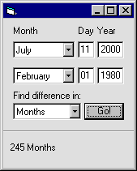



## Use the DateDiff Function

### Description

This code will tell you the difference between two dates.  

You can find the difference in Days and Months.

EASY CODE!!
 
### More Info
 
2 Dates

Difference is Dates (Days or Months)

             |
---                |---
**Submitted On**   |2000-07-11 09:18:58
**By**             |[Sparq](https://github.com/Planet-Source-Code/PSCIndex/blob/master/ByAuthor/sparq.md)
**Level**          |Beginner
**User Rating**    |4.5 (45 globes from 10 users)
**Compatibility**  |VB 3\.0, VB 4\.0 \(16\-bit\), VB 4\.0 \(32\-bit\), VB 5\.0, VB 6\.0, VB Script, ASP \(Active Server Pages\) 
**Category**       |[Math/ Dates](https://github.com/Planet-Source-Code/PSCIndex/blob/master/ByCategory/math-dates__1-37.md)
**World**          |[Visual Basic](https://github.com/Planet-Source-Code/PSCIndex/blob/master/ByWorld/visual-basic.md)
**Archive File**   |[CODE\_UPLOAD76847112000\.zip](https://github.com/Planet-Source-Code/sparq-use-the-datediff-function__1-9676/archive/master.zip)

